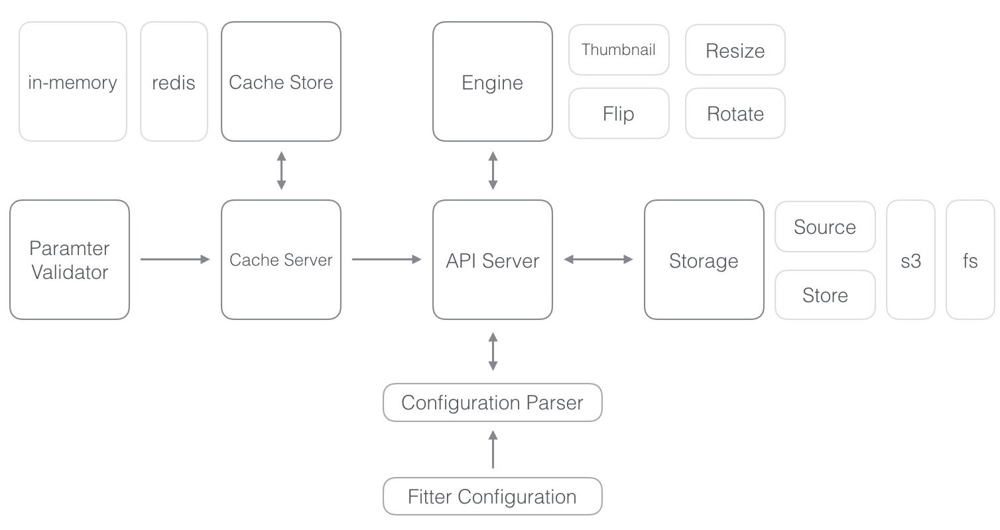

# fitter


The **fitter** is an on-demand image server for generating dynamic images. It provides some various actions and modes to generate the dynamic images with desired parameters. As on-demand means, **fitter** is an on-demand server to generate the various images for your mobile app and website whenever those need it. It can be used on following scenarios.

* Backend on-demand image server
* Local image transforming tool
* Image transforming and cloud backup tool

It can save the efforts of create the images before really needed it. So it can also save the storage space either.

<br>

# (Current) Architecture



<br>


# Features

- Provides various actions for generating a desired image such as resize, flip and rotate
- Provides various mode for getting an image (information)
- Supports caching for url path of generated image. It supports followings now
  - In-memory (use pure python dictionary)
  - Redis (as front cache server)
- Supports flexible backend storage modules
  - Able to specify the source storage and store (as destination) storage
  - Able to either use local file system or AWS S3 as backend storage 
- Provides a customizable configuration for fitter server
- *(Not yet)* Able to upload an image for generating image (optional)


<br>

# How to use

## On your machine (local or server)

1. `git clone git@github.com:mingrammer/fitter.git` (or use https)

2. `pip install -r requirements.txt`

   > *Note*: Install the required packages in an isolated enviroment if you use **virtualenv**

3. Run `cp fitter.yaml.sample fitter.yaml` and modify & set the fitter configuration with yours. (see the [configuration](#configuration))

4. `python3 run.py`

5. Enjoy with fitter API! (see the [usage](#usage))

## Use docker container

> Preparing. I'll support it ASAP

<br>

# Configuration

You must set the configuration `fitter.yaml` to use fitter first.

There could be several use cases fit to you. I'll introduce some of them here.

### Without caching, and use only local file system as storages (for both source and store)

If you only specify the `store` field, the `source` storage will be same as this config

```yaml
port: 6001

# You must specify the storage config
storage:
  # You should specify the storage type one of followings
  # 1. fs (refers to file system)
  # 2. s3 (refers to AWS S3)
  #
  # If you want to use a single storage for both source and store, you should set the 'store' only
  store:
    type: fs
    location: /users/mingrammer/desktop # get the image on from this location as root
```

### With redis cache server, and use the local file system and AWS S3 as source and store storage, respectively

```yaml
# Fitter server port, Default is 6001
port: 6001

# Optional
cache_store:
   # If you want to use it, should specify the cache server type one of followings
   # 1. redis
   # 2. in-memory
   type: redis
   host: localhost
   port: 6379
   db: 0

storage:
  source:
    type: fs
    location: /users/mingrammer/desktop
  store:
    type: s3
    aws_access_key_id: <you-aws-access-key-id>
    aws_secret_access_key: <your-aws-secret-access-key>
    bucket_name: my-storage
    bucket_region: ap-northeast-2
    location: /store/image/upload # cached image will be stored in location + '/cache'
```

### Same as 2, but also use the options

```yaml
port: 6001

cache_store:
   type: redis
   host: localhost
   port: 6379
   db: 0

storage:
  source:
    type: fs
    location: /users/mingrammer/desktop
  store:
    type: s3
    aws_access_key_id: <you-aws-access-key-id>
    aws_secret_access_key: <your-aws-secret-access-key>
    bucket_name: my-storage
    bucket_region: ap-northeast-2
    location: /store/image/upload

options:
  enable_upload: true # allows image uploading
  # TODO: Will supports followings
  # shard
  # prefix
  # allowed_size
  # allowed_format
  # thumbnail_size
```

<br>

# Usage

### API Usage

`http://<host>:<port>/<action>?mode=<mode>&path=<path>&format=<img_format>&width=<width>&height=<height>&upscale=<upscale>&quality=<quality>&direction=<direction>&degree=<degree>`

### ex) Resize the image to 300x400 in jpg with get action

`http://localhost:6001/get?mode=resize&path=/wallpaper/lion.png&format=jpg&width=300&height=400` 

### ex) Make a thumbnail of 600 width while preserving aspect ratio with show action

`http://localhost:6001/show?mode=thumbnail&path=/image/profile.png&width=600&height=0` 

### ex) Rotate the image by 90 degree with redirect action

`http://localhost:6001/redirect?mode=rotate&degree=90`

<br>

# API Description

* action

  * **/show**: Get the image information asynchronously. It is usefule on like `` tag. It will returns following json

    > Note: Can not use this asynchronously yet. I'll make it ASAP

    ```
    { 
    	'filename': 'image',
      	'path': 'path/to/image',
      	'url': 'http://<your-server-or-s3-server>/path/to/image'
    }
    ```

  * **/get**: Get the image information synchronously

    ```
    { 
    	'filename': 'image',
      	'path': 'path/to/image',
      	'url': 'http://<your-server-or-s3-server>/path/to/image'
    }
    ```

  * **/redirect**: Redirect to the generated image url

* GET parameters

  * **mode**: The operation mode. One of followings
    * thumbnail: make a thumbnail with desired width/height
    * resize: resize the image with desired width/height
    * flip: flip or flop the image with desired direction
    * rotate: rotate the image with desired degree
  * **path**: The path of image which is on source storage. Will be concatenated with `location` field of storage 
  * **format**: The desired format of image. Current supported list are:
    * png
    * jpg
    * jpeg
  * **width**: The desired width of image. If this value is 0, the aspect ratio of output image is preserved
  * **height** The desired height of image. If this value is 0, the aspect ratio of output image is preserved
  * **upscale**: Whether if upscale the image has size smaller than desired size
  * **quality**: The desired quality of image
  * **direction**: The desired direction to flip the image
    * 'h' or 'horizontal'
    * 'v' or 'vertical'
  * **degree**: The desired degree to rotate the image

<br>

# Todo

- [ ] **DO NOT SUPPORT PYTHON 2.X**
- [ ] Supports API authorization
- [ ] Supports **asynchronous** job for `show` mode
- [ ] Supports **image uploading** and processing with **external image url**
- [ ] Add some additional options such as `fixed size`, `prefix` and `shard`
- [ ] Provides a CLI for managing the fitter server: `fitter run`
- [ ] Supports more actions for dynamic image transforming
- [ ] Considering how use the fitter on serverless architecture (may use the AWS lambda mainly)
- [ ] Supports multi-clustering environment
- [ ] Test! Test! Test!
- [ ] More documentation
- [ ] Providing deploy process to use it as pluggable service easily